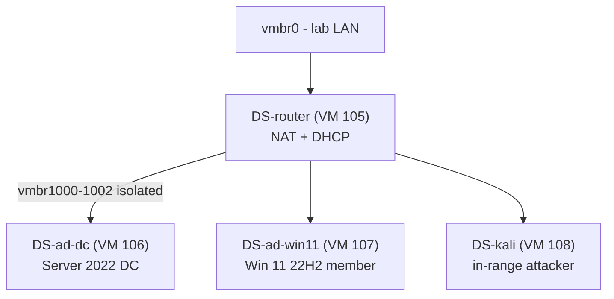

# Ludus Cyber Range

> A reproducible Active Directory attack-and-detection range on Proxmox, built with Ludus: one router, one domain controller, one domain-joined Windows 11 workstation, one Kali box.

**Category:** Homelab · **Status:** Active · **Stack:** [Ludus](https://ludus.cloud) on Proxmox VE · **Range ID:** `DS`

## Why Ludus

Hand-building an AD lab takes a weekend and rots the moment you break it. Ludus turns the range into a YAML file: golden templates are built once with Packer, the range is deployed with Ansible, and `ludus range deploy` rebuilds the whole thing from scratch in under an hour. That makes "snapshot, attack, detonate, revert" a normal workflow instead of a risk.

## Range layout



The range only reaches the internet through its own router VM, so anything that runs inside it, including live malware samples and C2 traffic, stays off the real LAN.

## Templates

Built once with `ludus templates build`, stored as VMs 100–104 on a dedicated NVMe volume group:

| VMID | Template |
|---:|---|
| 100 | `debian-12-x64-server-template` |
| 101 | `win11-22h2-x64-enterprise-template` |
| 102 | `kali-x64-desktop-template` |
| 103 | `debian-11-x64-server-template` (used by the router) |
| 104 | `win2022-server-x64-template` |

## Range config

The config that produces the inventory above (`ludus range config set -f range-config.yml`). Ludus creates the router automatically.

```yaml
ludus:
  - vm_name: "{{ range_id }}-ad-dc-win2022-server-x64"
    hostname: "{{ range_id }}-DC01"
    template: win2022-server-x64-template
    vlan: 10
    ip_last_octet: 11
    ram_gb: 8
    cpus: 4
    windows:
      sysprep: true
    domain:
      fqdn: ludus.domain
      role: primary-dc

  - vm_name: "{{ range_id }}-ad-win11-22h2-enterprise-x64-1"
    hostname: "{{ range_id }}-WS01"
    template: win11-22h2-x64-enterprise-template
    vlan: 10
    ip_last_octet: 21
    ram_gb: 8
    cpus: 4
    windows:
      sysprep: true
      install_additional_tools: true
    domain:
      fqdn: ludus.domain
      role: member

  - vm_name: "{{ range_id }}-kali"
    hostname: "{{ range_id }}-kali"
    template: kali-x64-desktop-template
    vlan: 99
    ip_last_octet: 1
    ram_gb: 8
    cpus: 4
    linux: true
    testing:
      snapshot: false
      block_internet: false
```

## Workflow

```bash
ludus templates list                    # confirm templates are built
ludus range config set -f range-config.yml
ludus range deploy                      # ~45 min from nothing to a joined domain
ludus range status
ludus range logs -f                     # watch Ansible

ludus range etc-hosts >> /etc/hosts     # name resolution from the workstation
ludus range rdp                         # RDP files for the Windows boxes

ludus snapshot create baseline          # before an exercise
ludus testing start                     # cut the range off from the internet
# ... attack / detonate / collect logs ...
ludus testing stop
ludus snapshot revert baseline
```

Day-to-day power is handled by [`lab-up`](../../tools/lab-power-scripts/): `--mode research` leaves VMs 105–108 off, the default `ds-lab` mode brings them up.

## What it is used for

- **Detection engineering.** Run a technique on the workstation or against the DC, then write and tune the rule that catches it. Windows Security, Sysmon and PowerShell logs from the DC and workstation are the primary sources.
- **AD attack practice.** Kerberoasting, AS-REP roasting, ACL abuse, lateral movement with the in-range Kali box, all against a domain that can be reverted in a minute.
- **Tooling validation.** Testing EDR / log forwarding configuration against known-bad activity before trusting it anywhere real.
- **Certification prep.** The range mirrors the small-enterprise shape used by practical pentest exams.

## Lessons learned

- **Give the range its own disk.** Template builds and deploys are I/O-heavy, so the range volume group lives on a second NVMe rather than competing with the other VMs.
- **Leave the range off when not in use.** Four VMs with 26 GB of RAM committed is a lot of idle heat. Hence the `research` mode.
- **Snapshot before every exercise, not after.** Reverting is the cheapest cleanup there is.
- **Keep the range isolated.** The router VM is the only path out. Do not bridge range VLANs onto the LAN "just for a minute".

## Skills demonstrated

Active Directory lab design · Ludus / Packer / Ansible · Proxmox networking and isolation · detection engineering workflow · attack simulation hygiene

## Related

- [Proxmox Lab Platform](../proxmox-lab-platform/) — the host
- [Lab Power Scripts](../../tools/lab-power-scripts/) — `--mode research` vs `ds-lab`
- [cyber-resources](https://github.com/Dstanfield-Creator/cyber-resources) — techniques practised here

---

**Author:** Danny Stanfield · Perth, WA  
**License:** MIT
