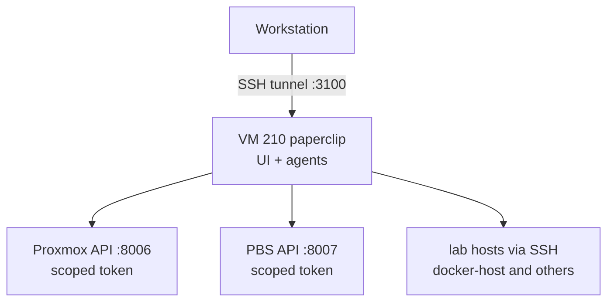

# Paperclip AI Agents on Proxmox

> A self-hosted [Paperclip](https://github.com/paperclipai/paperclip) instance where AI agents can inspect the lab, build and retire VMs, and read logs, all through least-privilege API tokens that cannot touch the backup server or themselves.

**Category:** Homelab · **Status:** Active (agents operating, access being widened host by host) · **Built:** September 2026 · **Platform:** VM 210 on Proxmox, 8 GB RAM, 64 GB disk

## Goal

Give a team of AI agents real operational reach into the homelab, with the same controls you would demand of a junior admin's service account: scoped permissions, protected crown jewels, auditable credentials, and a firewall that only lets in what is needed.

## Architecture



- Paperclip runs as an unprivileged user in a **systemd user unit**; logs via `journalctl _SYSTEMD_USER_UNIT=paperclipai.service`.
- The UI is only reached through an **SSH tunnel** (plain HTTP on the LAN address is rejected by the app), so there is no web port open on the VM at all.
- Agent credentials live in `~/.config/lab/` (dir 700, files 600): `lab.env` for non-secret settings, `proxmox.secret` and `pbs.secret` for token secrets, `pve-root-ca.pem` for TLS. A `LAB.md` in the agent's home describes the lab and the rules of engagement.

## Least-privilege Proxmox token

Agents need to create, start, stop and delete VMs, read storage, and read the syslog. They must **never** be able to delete the backup server or their own VM.

```bash
# custom role for syslog read, which no built-in role grants on its own
pveum role add PaperclipLogs -privs "Sys.Syslog"

pveum user add paperclip@pve
pveum user token add paperclip@pve agents --privsep 0

# broad but bounded on /
for role in PVEVMAdmin PVEDatastoreUser PVEAuditor PVESDNUser PaperclipLogs; do
  pveum acl modify / -user paperclip@pve -role $role
done

# downgrade to read-only on the two VMs that must survive anything
pveum acl modify /vms/210 -user paperclip@pve -role PVEAuditor
pveum acl modify /vms/211 -user paperclip@pve -role PVEAuditor

# belt and braces
qm set 210 --protection 1
qm set 211 --protection 1
```

Key points:

- **Token privileges are capped by the user's.** ACLs are granted to the user so the token inherits them; `--privsep 0` keeps the two in lockstep.
- **A more specific path wins.** `PVEAuditor` on `/vms/210` overrides `PVEVMAdmin` on `/`, so an agent can *see* its own VM but cannot stop or delete it.
- **`protection=1`** means even a token with the right role gets `can't remove VM: protection enabled`.

The PBS token was given `Admin` so agents can run restores and prune; this was a deliberate, recorded trade-off rather than an oversight.

## Host firewall

UFW on the VM: SSH from the lab subnet only, nothing else inbound; outbound to the hypervisor and PBS APIs. Enabling it the first time **froze the SSH session** that ran the command, even with correct rules, because connection tracking classified the existing session's packets as `INVALID`. A pre-armed systemd timer disabled UFW three minutes later and restored access. The procedure that came out of it is documented in [Firewall Dead-Man Switch](../../tools/firewall-deadman-switch/); the firewall was then enabled out-of-band with `qm guest exec 210 -- ufw --force enable`.

## Backups

VM 210 is in the weekly PBS job alongside the range.

## Open items

- [ ] Distribute the agents' SSH key (`paperclip-agents@paperclip`) to the Docker host and other Linux guests, scoped with `command=`/`from=` options in `authorized_keys`.
- [ ] Router syslog → the Docker host, so agents can read network logs without router credentials.
- [ ] Per-agent budgets and a board-approval gate for VM creation (Paperclip supports both).

## Lessons learned

- **Design the blast radius before the first agent runs.** Protected VMs and path-specific role overrides took ten minutes and remove the worst-case outcome entirely.
- **Enable firewalls out-of-band.** See the dead-man switch write-up.
- **Keep secrets out of the agent's reach where possible.** The agents get token secrets they need and nothing else; admin SSH to the hypervisor is a different user, a different key, and a different machine.

## Skills demonstrated

Proxmox RBAC and API token design · systemd user services · UFW hardening · secure credential handling · AI agent operations / guardrails

## Related

- [Proxmox Lab Platform](../proxmox-lab-platform/) · [Proxmox Backup Server](../proxmox-backup-server/) · [Firewall Dead-Man Switch](../../tools/firewall-deadman-switch/) · [Tailscale Remote Access](../tailscale-remote-access/)

---

**Author:** Danny Stanfield · Perth, WA  
**License:** MIT
