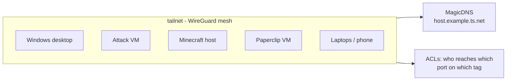

# Tailscale Remote Access

> Zero-trust remote access to the lab without a single port-forward: a WireGuard mesh, MagicDNS names as the stable handle for every host, and SSH keys that never leave 1Password.

**Category:** Homelab · **Status:** Active · **Stack:** Tailscale · OpenSSH · 1Password SSH agent

## Problem

Three things kept breaking SSH to the lab:

1. **LAN addresses drift.** DHCP leases moved; a workstation went from `.28` to `.176` and every hand-written SSH entry pointing at it broke.
2. **Off-LAN access.** From a laptop or phone hotspot the LAN addresses mean nothing, and exposing SSH or the Proxmox UI to the internet was never an option.
3. **Key sprawl.** Private keys on every device, no central record of which key could reach what.

## Design



- **Every lab host runs Tailscale**, including VMs on Proxmox. Nothing is port-forwarded on the home router.
- **MagicDNS names, not IPs, in `~/.ssh/config`.** `nxdh02.example.ts.net` resolves on and off the LAN, and when both ends are on the same LAN Tailscale negotiates a direct path, so there is no latency penalty (~3 ms locally).
- **Keys live in 1Password.** The SSH agent is 1Password's; `~/.ssh/config` points at its socket with `IdentityAgent`, so no private key files sit on disk and 1Password approves each use.
- **Hosts that are LAN-only stay LAN-only.** The hypervisor, PBS and the Docker host are reached by LAN IP from inside the lab, and via a tailnet host when away. Their firewalls allow SSH from the lab subnet only.

### `~/.ssh/config` shape

```sshconfig
Host *
    IdentityAgent ~/.1password/agent.sock
    ServerAliveInterval 30

# Workstations — tailnet names, stable across DHCP changes
Host desktop
    HostName desktop.example.ts.net
    User admin
Host l                      # one letter: it is used fifty times a day
    HostName nxdh02.example.ts.net
    User me

# Lab VMs — LAN addresses, firewalled to the LAN
Host pve
    HostName 192.0.2.10
    User admin
Host docker-host
    HostName 192.0.2.20
    User admin
Host paperclip
    HostName 192.0.2.30
    User admin
```

## Access policy

| Path | Allowed | How |
|---|---|---|
| Workstation → any lab VM, port 22 | yes | key auth only, `PasswordAuthentication no` |
| Internet → anything | no | no port-forwards exist |
| Tailnet → Proxmox UI :8006 | yes, via a tailnet host | SSH tunnel or Tailscale subnet route |
| Tailnet → Minecraft :25565 | tailnet members | Tailscale, no port-forward |
| LAN → Paperclip :3100 | no (plain HTTP rejected) | SSH tunnel `-L 3100:localhost:3100` |

## Verification

[`lab-ssh-check`](../../tools/lab-ssh-check/) runs after every `lab-up` and distinguishes DOWN / DNS / AUTH / HOSTKEY, which is exactly the set of failures this design is meant to eliminate. A typical healthy run shows every tailnet host authenticating in under 600 ms.

## Lessons learned

- **If `ssh` suddenly prompts for a password, the agent is the problem, not the key.** The 1Password agent not being picked up presents identically to a missing key. Check `SSH_AUTH_SOCK` and the `IdentityAgent` line first.
- **One-way trust is fine.** The desktop can reach the workstation; the workstation was never given a key to the desktop. The check script lists that direction as SKIP rather than failing on it.
- **Tailnet names survive DHCP; IPs do not.** The workstation's LAN address changed once and broke every entry that pointed at it. Nothing pointing at its tailnet name has broken since.
- **Decommission in the config too.** A retired Pi's entry stayed in `~/.ssh/config` for weeks and showed as DOWN every run. Remove or SKIP retired hosts on the day they go.

## Skills demonstrated

Zero-trust network access · WireGuard / Tailscale · SSH hardening and configuration · secrets management with 1Password · operational verification

## Related

- [lab-ssh-check](../../tools/lab-ssh-check/) · [Proxmox Lab Platform](../proxmox-lab-platform/) · [Minecraft Server](../minecraft-server/) · [Paperclip AI Agents](../paperclip-ai-agents/)

---

**Author:** Danny Stanfield · Perth, WA  
**License:** MIT
