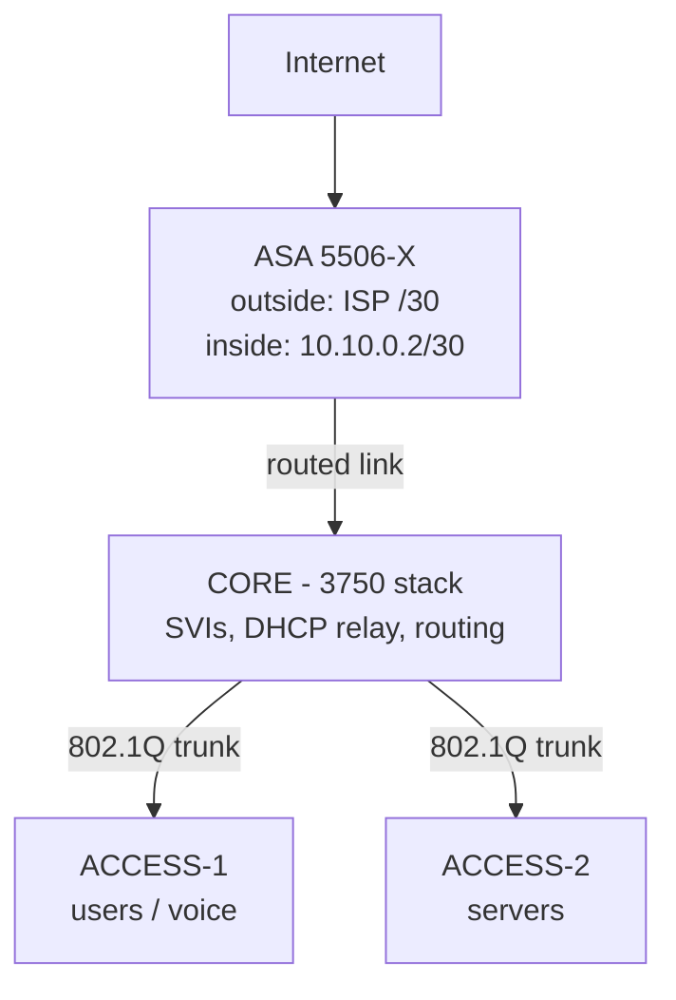

# Cisco Enterprise Network Design

> A small-enterprise reference design built as a lab: multi-VLAN campus on Catalyst multilayer switches, a Cisco ASA at the edge, centralised DHCP and DNS, and the verification steps that prove each layer works.

**Category:** Infrastructure (lab design) · **Status:** Completed · **Platform:** Cisco Catalyst multilayer (core) and access switches, Cisco ASA edge, Windows Server for DHCP/DNS. Built and verified in a lab; model numbers in the excerpts are representative.

## Design goals

- Separate users, servers, voice, management and guest traffic into VLANs with policy between them.
- Route between VLANs at the core (SVIs), not at the firewall, so east-west traffic stays fast.
- Terminate the internet edge on an ASA with NAT, a default-deny inbound policy, and remote-access VPN.
- Central DHCP with relay from every VLAN, and internal DNS that the firewall and switches also use.
- Everything verifiable with `show` commands.

## Topology



## VLAN and addressing plan

| VLAN | Name | Subnet | Gateway (SVI) | Notes |
|---:|---|---|---|---|
| 10 | MGMT | 10.10.10.0/24 | .1 | switch/ASA management, no user ports |
| 20 | USERS | 10.10.20.0/24 | .1 | DHCP, 802.1X-ready |
| 30 | SERVERS | 10.10.30.0/24 | .1 | static, DC/DHCP/DNS at .10 |
| 40 | VOICE | 10.10.40.0/24 | .1 | voice VLAN on user ports, QoS trust |
| 50 | GUEST | 10.10.50.0/24 | .1 | internet only, isolated by ACL |
| 99 | NATIVE | — | — | unused native VLAN on trunks |
| — | CORE↔ASA | 10.10.0.0/30 | — | routed point-to-point |

## Core switch configuration (excerpt)

```
hostname CORE
ip routing
vtp mode transparent
spanning-tree mode rapid-pvst
spanning-tree vlan 1-99 priority 4096

vlan 10
 name MGMT
vlan 20
 name USERS
vlan 30
 name SERVERS
vlan 40
 name VOICE
vlan 50
 name GUEST
vlan 99
 name NATIVE

interface Vlan10
 ip address 10.10.10.1 255.255.255.0
interface Vlan20
 ip address 10.10.20.1 255.255.255.0
 ip helper-address 10.10.30.10
interface Vlan30
 ip address 10.10.30.1 255.255.255.0
interface Vlan40
 ip address 10.10.40.1 255.255.255.0
 ip helper-address 10.10.30.10
interface Vlan50
 ip address 10.10.50.1 255.255.255.0
 ip helper-address 10.10.30.10
 ip access-group GUEST-IN in

! routed uplink to the ASA
interface GigabitEthernet1/0/1
 no switchport
 ip address 10.10.0.1 255.255.255.252
ip route 0.0.0.0 0.0.0.0 10.10.0.2

! trunks to access switches
interface range GigabitEthernet1/0/2 - 3
 switchport trunk encapsulation dot1q
 switchport mode trunk
 switchport trunk native vlan 99
 switchport trunk allowed vlan 10,20,30,40,50
 switchport nonegotiate

! guest VLAN: internet only
ip access-list extended GUEST-IN
 permit udp any host 10.10.30.10 eq bootps
 permit udp any host 10.10.30.10 eq domain
 deny   ip any 10.10.0.0 0.0.255.255
 permit ip any any
```

## Access switch (excerpt)

```
interface range FastEthernet0/1 - 24
 switchport mode access
 switchport access vlan 20
 switchport voice vlan 40
 switchport port-security
 switchport port-security maximum 2
 switchport port-security violation restrict
 spanning-tree portfast
 spanning-tree bpduguard enable
interface GigabitEthernet0/1
 switchport mode trunk
 switchport trunk native vlan 99
 switchport trunk allowed vlan 10,20,30,40,50
interface Vlan10
 ip address 10.10.10.11 255.255.255.0
ip default-gateway 10.10.10.1
```

## ASA (excerpt)

```
interface GigabitEthernet1/1
 nameif outside
 security-level 0
 ip address dhcp setroute
interface GigabitEthernet1/2
 nameif inside
 security-level 100
 ip address 10.10.0.2 255.255.255.252

route inside 10.10.0.0 255.255.0.0 10.10.0.1

object network CAMPUS
 subnet 10.10.0.0 255.255.0.0
 nat (inside,outside) dynamic interface

! default: inside → outside allowed, nothing inbound
access-list OUTSIDE-IN extended deny ip any any log
access-group OUTSIDE-IN in interface outside

dns domain-lookup inside
dns server-group DefaultDNS
 name-server 10.10.30.10
```

## DHCP and DNS

A Windows Server at `10.10.30.10` runs AD-integrated DNS and DHCP with one scope per VLAN (20, 40, 50), option 3 router = the SVI, option 6 DNS = itself, and option 150 for phones in the voice scope. Every SVI that serves clients carries `ip helper-address 10.10.30.10`, so one DHCP server covers the campus. The switches and ASA use the same DNS so names resolve everywhere.

## Verification

```
CORE# show vlan brief
CORE# show interfaces trunk
CORE# show ip interface brief | include Vlan
CORE# show ip route
CORE# show ip dhcp relay statistics     ! relays incrementing per VLAN
ACCESS-1# show port-security interface fa0/1
ASA# show nat
ASA# show conn count
ASA# packet-tracer input inside tcp 10.10.20.50 12345 8.8.8.8 443
PC(VLAN20)> ipconfig /all        ! gateway .1, DNS .10, lease from 10.10.20.x
PC(VLAN50)> ping 10.10.30.10     ! fails (guest ACL), while internet works
```

## Design decisions

- **Routing at the core, filtering at the edge.** SVIs keep server-to-user traffic off the firewall; the ASA only sees north-south.
- **Unused native VLAN on trunks** and `nonegotiate` to remove VLAN-hopping and DTP tricks.
- **Guest isolation by ACL at the SVI** rather than at the firewall, so guest traffic never touches the server VLAN even in transit.
- **Port-security + BPDU guard** on every access port as the minimum before 802.1X.

## Skills demonstrated

Layer 2/3 campus design · VLANs and 802.1Q trunking · inter-VLAN routing and SVIs · DHCP relay · Cisco ASA NAT and policy · network hardening · structured verification

## Related

- [Network Optimisation & Security Enhancement](../network-security-enhancement/) — the production work this lab design mirrors
- [Proxmox Lab Platform](../../homelab/proxmox-lab-platform/) — the same segmentation idea applied with Linux bridges

---

**Author:** Danny Stanfield · Perth, WA  
**License:** MIT
